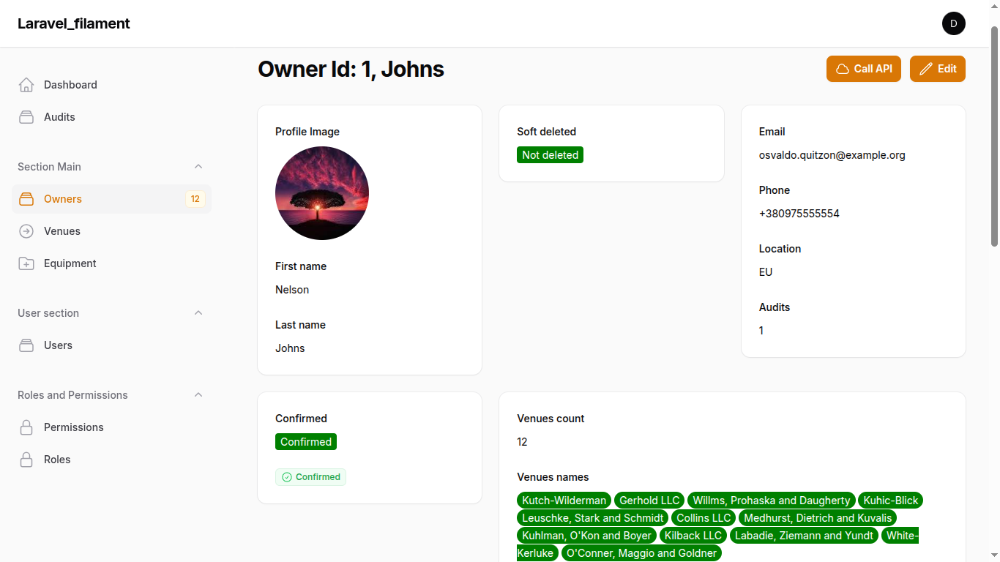
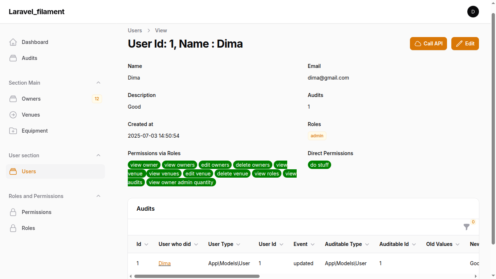
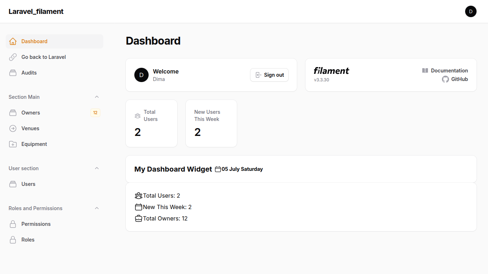

<!-- Status badges -->

> Laravel: 12.18, PHP: 8.4.8 , Filament: 3, mysql: 8.0.42, db: '',   
What is new: Filament 3, Sail, Sanctum, CI/CD, Laravel Audit, PHPStan static analysis tool 2.1.17, Pint, Tailwind CSS out of the box, Vue 3, Pinia insead of Vuex store, dotswan/filament-map-picker

 Represents data from 3 main tables (owners (HasMany), venues (BelongsToMany), equipments) in 4 ways: REST API, Filament, Vue JS, regular Laravel Controller + Blade 

Visual Studio Code ()
     -> VS package extension -> 
           -> PHP Namespace Resolver (to import class -> RMC -> import class)(https://marketplace.visualstudio.com/items?itemName=MehediDracula.php-namespace-resolver)
           -> Git History, GitLense, Php Intellisense, Prittier, Highlight Matching Tag, GitLens — Git supercharged, Notepad VS theme

GIT_EDITOR="nano" git rebase -i HEAD~11
git restore .  git clean -fd

  main page  =>  http://localhost:8000/     (u screwed ports with phpmyadmin)
  phpMyAdmin => http://localhost:8080/   (login=sail, pass=password)

### Content
- [1. Install Laravel 12](#1-install-laravel-12)
- [2. Docker sail](#2-docker-sail)
- [3. Filament3](#3-filament3)
- [4. Pest tests](#3-pest-test)
- [5. Spatie permission](#5-spatie-permission)
- [6. Run Php via built-in web server ](#6-run-php-via-built-server)
- [7. Images](#7-images)
- [8. Postman](#8-postman)
- [9. Sanctum](#9-sanctum)
- [10.PhpStan](#10-phpstan)
- [11.Vue](#11-vue)
- [12.Pint](#12-pint)

- [111.V.A](#111-va)

- [103. Screenshots](#2-screenshots)

 ----------------------------------------------------------------------------------------- 

## 1. Install Laravel 12
Doker/Sail variant

1. Install => <code> composer create-project --prefer-dist laravel/laravel my-app "^12.0"  </code> 

1.1 cd to folder and <code> php artisan sail:install </code>  You'll be prompted to choose services (e.g., MySQL, Redis, MailHog)

1.2 Check in  .env  that  DB_CONNECTION=mysql & optionally for convenience change DB_DATABASE=YOUR_PREFFERED_NAME (Sail will create db with this name)  
1.2 Edit docker-compose.yml and add PhpMyAdmin service, see example in Filament 12, just in port use ports:- 8081:80, not - 8080:80, so u can access it with  http://localhost:8081 and avoid conflicts with laravel app.  
 

1.2 Start Docker containers <code> ./vendor/bin/sail up -d </code> 

1.3 Install dependencies=> <code> ./vendor/bin/sail composer install </code>  or out of container <code> composer install </code>  

Copy .env.example to .env if not already done:

2. Generates the APP_KEY and writes it to .env in container =>  <code> ./vendor/bin/sail artisan key:generate </code>  OR old version <code> php artisan key:generate </code> 

  Migrate => <code>  ./vendor/bin/sail artisan migrate </code> 
  NPM must have    => <code> ./vendor/bin/sail npm install      </code>
  Build must have || Vite manifest error  => <code> ./vendor/bin/sail npm run build    </code>

 
Mega FIX  when '/' gives 404, but other routes are fine. Try in incognito. Clear cookies and session. In my case it started after u added PhpMyAdmin to docker-compose.yml

FIX if 404  => Give the correct ownership to storage/ and bootstrap/cache/ => in folder, but out of Container
<code> 
sudo chown -R $USER:$USER storage bootstrap/cache
sudo chmod -R 775 storage bootstrap/cache
</code> 
In .env add  
WWWUSER=1000
WWWGROUP=1000

If table session is missing 
./vendor/bin/sail artisan session:table
./vendor/bin/sail artisan migrate

4. In browser can navigate to http://localhost:8000/  OR http://localhost  depending on docker-compose.yml => the project should open 

5. In console CLI <code> cd NAME_HERE </code> , and <code>git init   git add.   git commit</code> if necessary 

6. Create DB and set in <code>.env (DB_DATABASE)  == NO,IT IS CREATED BY SAIL by .env</code> 

7. Install auth Breeze  <code> composer require laravel/breeze --dev </code> 
     Scaffold the auth system  <code> php artisan breeze:install </code>  and run migratations. It will also install test Pest or PhpUnit and wipe all routes u have added by yourself

8. Be aware, there is no  <b> routes/api.php </b>, create it manually by  <code> php artisan install:api</code> . It installs Sanctum as well and migration <b>personal_access_tokens_table </b>

 ----------------------------------------------------------------------------------------- 

## 2. Docker sail

<code> ./vendor/bin/sail up </code>
<code> ./vendor/bin/sail shell </code>  == <code>./vendor/bin/sail bash </code>  #go to container
<code> ./vendor/bin/sail down </code>

<code> docker exec -it my_filament_laravel_12-laravel.test-1 /bin/bash  </code>  #go to container manually

 ----------------------------------------------------------------------------------------- 

## 3. Filament3

Available at http://localhost:8000/admin/, could not open /admin because of wrong settings in App\Providers\Filament\Admin1PanelProvider.php

 Install Filament 
 
<code> composer require livewire/livewire:^3.0</code>

<code>composer require filament/filament:"^3.3" -W </code>
<code>php artisan filament:install --panels </code>
<code>php artisan make:filament-user </code>

php artisan vendor:publish --tag=filament-config

php artisan vendor:publish --tag=filament-config     //optional to modify
 

 Create Relation-manager
 
php artisan make:filament-relation-manager OwnerResource venues owner_id

 ----------------------------------------------------------------------------------------- 

## 4. Pest test

<code> ./vendor/bin/pest </code>  run all test (since docker, do it inside container)  ||  <code>composer run-pest-tests</code>

Run one test Class => <code>  ./vendor/bin/pest tests/Feature/App/Filament/RelationManagers/VenuesRelationManagerTest.php  </code> 

Run one method from test Class => --filter {methodName} {pathToClass} =>  <code> ./vendor/bin/pest --filter="can list venues in relation manager" tests/Feature/App/Filament/RelationManagers/VenuesRelationManagerTest.php  </code>

 
 If tests are failing, clear cache in testing environment  <code>  php artisan config:cache --env=testing </code>  

 
Before testing, first time ever, do migrate tables to test database (dont seed as we run them in test itself), if have issues  <code> php artisan migrate:fresh --env=testing </code>  

 ----------------------------------------------------------------------------------------- 

## 5. Spatie permission

<code>  composer require spatie/laravel-permission </code> 
php artisan vendor:publish --provider="Spatie\Permission\PermissionServiceProvider"
php artisan migrate
In Models/User   =>  use HasRoles; //Spatie Permission

In regular controllers(not filament) u should use this to restrict access $this->authorize('view_owner_admin_quantity', Owner::class); 
If it fails, make sure your controller extends base controller <b> App\Http\Controllers\Controller</b> and it has <code>use AuthorizesRequests,</code>

<b>  Add GUI to Filament via plugin  </b>

https://filamentphp.com/plugins/tharinda-rodrigo-spatie-roles-permissions#installation

composer require althinect/filament-spatie-roles-permissions

 By default, Spatie models Role and Permission go inside /vendor => Spatie\Permission\Models\Role, Spatie\Permission\Models\Role    
If you want to have these models in your /models and be able to edit them, create /models/Role and extend Spatie\Permission\Models\Role +  update config/permission.php then. See details in /models/Role    

<b>  How restrict access with Spatie </b>

1. Define policy for each model. For Filament, do not need to register them in Controller, like in regular Laravel with  <code>$this->authorize('view', Owner::class); </code>    

  <b>List of policies for Filament/regular Laravel</b>
   View list    viewAny(User $user)
   View Record	view(User $user, Model $model)
   Create	    create(User $user)
   Update	    update(User $user, Model $model)
   Delete	    delete(User $user, Model $model)
   </code>

1. Prohibit access to Resouce by adding Policy (works by Model)

2. In Filament, you can hide panel by adding to Resource 
<code>
public static function shouldRegisterNavigation(): bool {
    return auth()->user()?->hasAnyRole(['admin', 'user']);  //return auth()->user()?->hasRole('admin');
}
</code>

3. In Filament, you can restrict acces to Relation manager by adding 
<code>
public static function canView(): bool { return auth()->user()->hasRole('admin');}

//disable creation/editing/deletion:
public static function canCreate(): bool { return false;}
    
public static function canEdit(Model $record): bool { return false; }
   
public static function canDelete(Model $record): bool { return false;}
</code>

 ----------------------------------------------------------------------------------------- 

## 6. Run Php via built server

go to your folder with php scripts , run <code> php -S localhost:8000 </code> 

Go to your site  <b> http://localhost:8000/yourfile.php </b>, e.g http://localhost:8000/display.php

 ----------------------------------------------------------------------------------------- 

## 7. Images

<code>php artisan storage:link</code>

images go to  /storage/app/public

 ----------------------------------------------------------------------------------------- 

## 8. Postman

When send Post, for example, to /api/owner/create,  in Postman go to Body-> Raw -> Json
<code> 
{
  "first_name": "John Doe",
  "last_name": "Name",
  "location": "UAR",
  "email": "john@example.com",
  "phone": "+380976563983",
  "owner_venue": [1]
}
</code> 

  
 Make sure to add in Postman "Headers" => <code>  Accept: application/json </code> , so $this->wantsJson() is working, e.g in OwnerRequest.php

 For Sanctum, generate token in console  with <code> php artisan get_sanctum_token </code>,   and add in Postman in Headers -> Key/Value:  Authorization  Bearer 4|uYx01a2 
 

 ----------------------------------------------------------------------------------------- 

## 9. Sanctum
<code> 
  //generate token 
  $user = User::find(1)->first();
  // Create a token with optional name and scopes
  $token = $user->createToken('postman-token')->plainTextToken;
</code> 

 ----------------------------------------------------------------------------------------- 

## 10. PhpStan

Run check <code> ./vendor/bin/phpstan analyse  </code>
Generate baseline "phpstan-baseline.neon" <code> ./vendor/bin/phpstan analyse --generate-baseline=phpstan-baseline.neon code> 
Add baseline to config in phpstan.neon

 ----------------------------------------------------------------------------------------- 

## 11. Vue
Vue is not installed by default, so 
1. <code> npm install vue@3 @vitejs/plugin-vue </code> 
2. in  vite.config.js  -> add vue 
3. in /resources/js.app.js  -> import vue & init component + create component itself e.g in resources/js/components/ExampleComponent.vue
4. use in Blade: <example-component></example-component> +  @vite('resources/js/app.js')
5. <code> npm run build  </code> 
npm run dev → runs Vite dev server (hot reload, for local development).
npm run build → builds production assets into public/build.

install axios, sweetalert2, Pinia insead of Vuex store, Element Plus insead of Element UI(supported in Vue 2 only), vue-router@4, jquery, mapbox-gl

 
Piania brief:
<code>
import { useOwnerStore } from '@/store/index'; //Piania store, instead of Vuex 

computed: {
  //get Piania store
  store() { return useOwnerStore();},

//may address like => this.store.posts
</code>

 ----------------------------------------------------------------------------------------- 

# 12. Pint
 Config =>  pint.json

<code> ./vendor/bin/pint --test </code>   shows what would be fixed, without changing files.
<code> ./vendor/bin/pint </code>  fix

</code> ./vendor/bin/sail pint </code> 

 ----------------------------------------------------------------------------------------- 

## 111. V.A

 Filament
 

 // If u have explicit relation, use ->formatStateUsing, 'venues' - is realtion, 'venue_name' = is column from related table
 <code>
 Infolists\Components\TextEntry::make('venues.venue_name')->label('Venues names') 
 //Infolists\Components\TextEntry::make('permissions.name') //or this for example
  ->formatStateUsing(fn ($state, $record) => 
      collect($record->venues)->map(fn ($venue) => 
        ''  .$venue->venue_name .  ''
      )->implode(' ')
  )
  ->html(), // Important: allow HTML rendering
</code>

// If u dont have explicit relation name , use ->state
<code>
Infolists\Components\TextEntry::make('permissions_from_roles')
  ->label('Permissions via Roles')
  ->state(function ($record) {
    return $record->getPermissionsViaRoles()
      ->map(fn ($perm) => '' . e($perm->name) . '')
      ->implode(' ');
  })
  ->html(),
</code>

 ----------------------------------------------------------------------------------------- 

## 103. Screenshots
   
   
   
   
   

## About Laravel

Laravel is a web application framework with expressive, elegant syntax. We believe development must be an enjoyable and creative experience to be truly fulfilling. Laravel takes the pain out of development by easing common tasks used in many web projects, such as:

- [Simple, fast routing engine](https://laravel.com/docs/routing).
- [Powerful dependency injection container](https://laravel.com/docs/container).
- Multiple back-ends for [session](https://laravel.com/docs/session) and [cache](https://laravel.com/docs/cache) storage.
- Expressive, intuitive [database ORM](https://laravel.com/docs/eloquent).
- Database agnostic [schema migrations](https://laravel.com/docs/migrations).
- [Robust background job processing](https://laravel.com/docs/queues).
- [Real-time event broadcasting](https://laravel.com/docs/broadcasting).

Laravel is accessible, powerful, and provides tools required for large, robust applications.

## Learning Laravel

Laravel has the most extensive and thorough [documentation](https://laravel.com/docs) and video tutorial library of all modern web application frameworks, making it a breeze to get started with the framework.

You may also try the [Laravel Bootcamp](https://bootcamp.laravel.com), where you will be guided through building a modern Laravel application from scratch.

If you don't feel like reading, [Laracasts](https://laracasts.com) can help. Laracasts contains thousands of video tutorials on a range of topics including Laravel, modern PHP, unit testing, and JavaScript. Boost your skills by digging into our comprehensive video library.

## Laravel Sponsors

We would like to extend our thanks to the following sponsors for funding Laravel development. If you are interested in becoming a sponsor, please visit the [Laravel Partners program](https://partners.laravel.com).

### Premium Partners

- **[Vehikl](https://vehikl.com)**
- **[Tighten Co.](https://tighten.co)**
- **[Kirschbaum Development Group](https://kirschbaumdevelopment.com)**
- **[64 Robots](https://64robots.com)**
- **[Curotec](https://www.curotec.com/services/technologies/laravel)**
- **[DevSquad](https://devsquad.com/hire-laravel-developers)**
- **[Redberry](https://redberry.international/laravel-development)**
- **[Active Logic](https://activelogic.com)**

## Contributing

Thank you for considering contributing to the Laravel framework! The contribution guide can be found in the [Laravel documentation](https://laravel.com/docs/contributions).

## Code of Conduct

In order to ensure that the Laravel community is welcoming to all, please review and abide by the [Code of Conduct](https://laravel.com/docs/contributions#code-of-conduct).

## Security Vulnerabilities

If you discover a security vulnerability within Laravel, please send an e-mail to Taylor Otwell via [taylor@laravel.com](mailto:taylor@laravel.com). All security vulnerabilities will be promptly addressed.

## License

The Laravel framework is open-sourced software licensed under the [MIT license](https://opensource.org/licenses/MIT).
