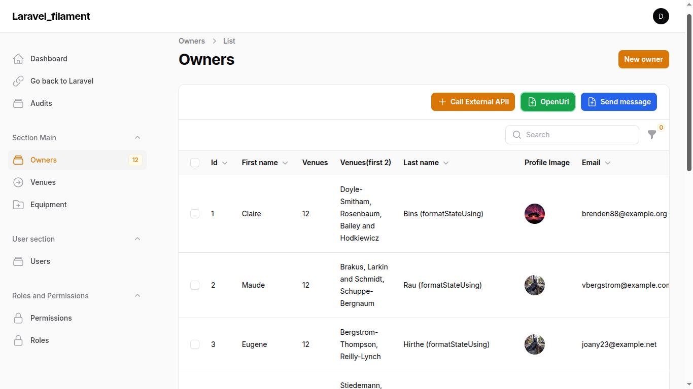
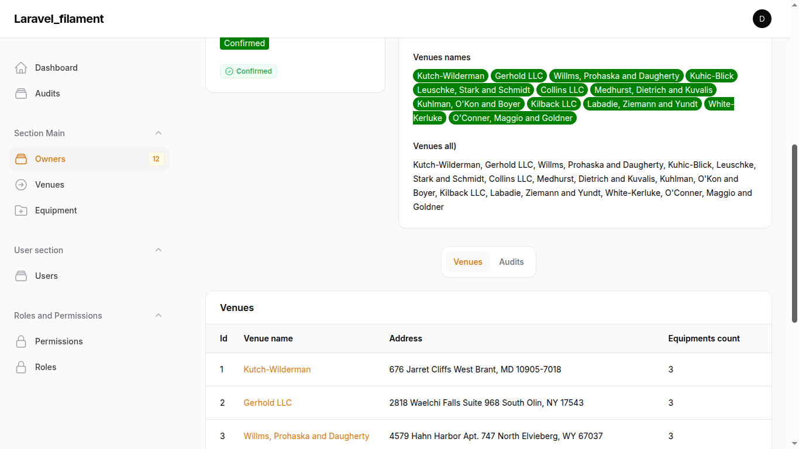
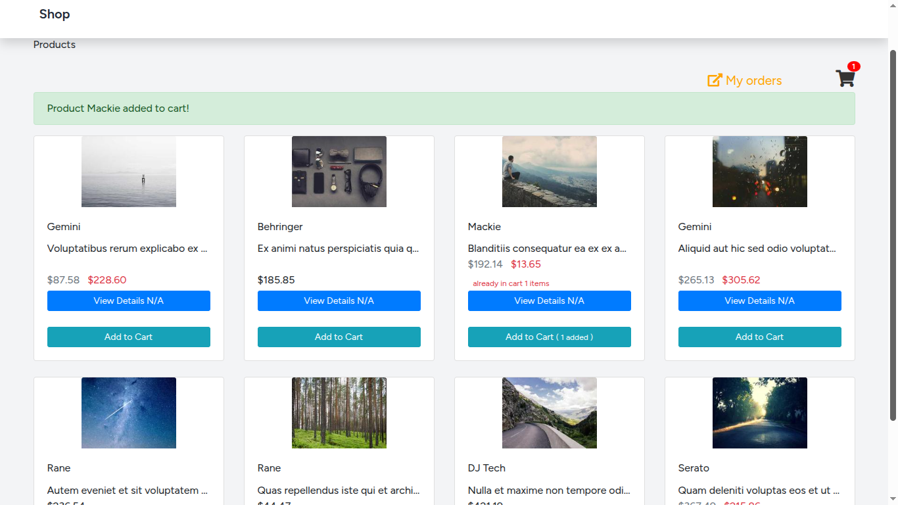
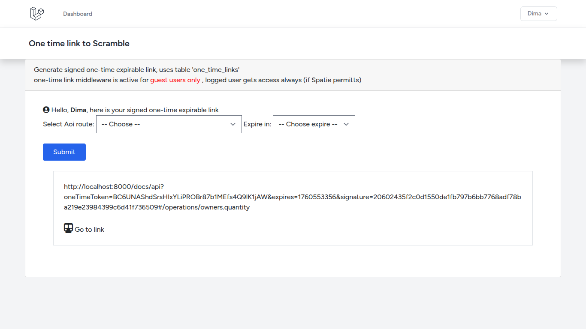
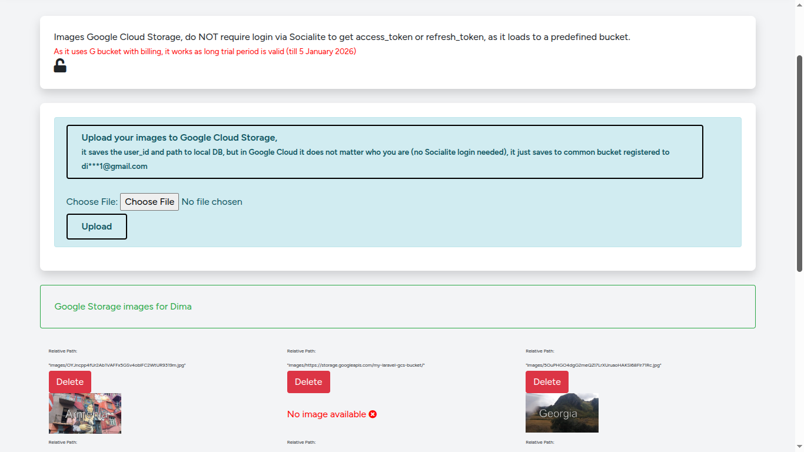

<!-- Status badges -->

> Laravel: 12.18, PHP: 8.4.8 , Filament: 3, mysql: 8.0.42, db: '',   
Contains 80% of Laravel_2024_migration transffered from Laravel 6 to 12 + Filament + Stripe + E-commerce shop, etc 
What is new: Filament 3, Sail, Sanctum, CI/CD, Laravel Audit, PHPStan static analysis tool 2.1.17, Pint, Tailwind CSS out of the box, Vue 3, Pinia insead of Vuex store, dotswan/filament-map-picker, Laravel Cashier with Stripe, Sentry, Prometheus_and_Grafana, 
Scramble – Laravel OpenAPI (Swagger), one-time expirable signed routes(signed means that URL includes a signature hash), send emails,
auto SQL db back-up via sheduled job + save it at G Drive (saves to pre-defined G Drive at dim***1@gmail.com), Socialite to get oAuth access token (login via Google), images at Google Cloud Storage bucket, upload files to personal Google Drive, Google BigQuery (saving analytics), displaying BQ data in Blade, Vue (Options API), git cola, Sanctum type 2 (SPA Authentication (Session-Based / Cookie Authentication)),Booking on Vue

 Represents data from 3 main tables (owners (HasMany), venues (BelongsToMany), equipments) in 4 ways: REST API, Filament, Vue JS, regular Laravel Controller + Blade 

Visual Studio Code ()
     -> VS package extension -> 
           -> PHP Namespace Resolver (to import class -> RMC -> import class)(https://marketplace.visualstudio.com/items?itemName=MehediDracula.php-namespace-resolver)
           -> Git History, GitLense, Php Intellisense, Prittier, Highlight Matching Tag, GitLens — Git supercharged, Notepad VS theme

GIT_EDITOR="nano" git rebase -i HEAD~11
git restore .  git clean -fd

  main page  =>  http://localhost:8000/     (custom url as u screwed ports with phpmyadmin, set up in APP_URL in .env)
  phpMyAdmin => http://localhost:8080/   (login=sail, pass=password)

  Credentials => freemail.u**.net => Paypal and other tokens + attachments (.env and json keys)

### Content
- [1. Install Laravel 12](#1-install-laravel-12)
- [1.2 Deploy this app from Git](#1.2-deploy-this-app-from-git)
- [2. Docker sail](#2-docker-sail)
- [3. Filament3](#3-filament3)
- [4. Pest tests](#4-pest-test3)
- [5. Spatie permission](#5-spatie-permission)
- [6. Run Php via built-in web server ](#6-run-php-via-built-server)
- [7. Images](#7-images)
- [8. Postman](#8-postman)
- [9. Sanctum](#9-sanctum)
- [10. PhpStan](#10-phpstan)
- [11. Vue](#11-vue)
- [12. Pint](#12-pint)
- [13.Laravel update 6 to 12](#13-laravel-update-6-to-12)
- [14. Laravel cashier with Stripe](#14-laravel-cashier-with-stripe)
- [15. Laravel Expose](#15-laravel-expose)
- [16. Sentry with Laravel](#16-sentry-with-laravel)
- [17. Prometheus and Grafana](#17-prometheus-and-grafana)
- [18. Scramble and one-time-links](#18-scramble-and-one-time-links)
- [19. Jobs](#19-jobs)
- [19.2 Scheduled jobs](#19.2-scheduled-jobs)
- [20. Socialite Oauth](#20-socialite-oauth)
- [21. SQL DataBase auto back-up job](#21-sql-dataBase-auto-back-up-job)
- [22. Save Images to Google Cloud Storage](#22-save-images-to-google-cloud-storage-bucket-in-laravel)
- [23. Google BigQuery](#23-google-bigquery)
- [24. Booking on Vue](#24-booking-on-vue)
- [25. Render.com](#25-render.com)

- [111.V.A](#111-va)
- [112.Known errors ](#112-known-errors)
- [103. Screenshots](#2-screenshots)

 ----------------------------------------------------------------------------------------- 

## 1. Install Laravel 12
Doker/Sail variant

1. Install => <code> composer create-project --prefer-dist laravel/laravel my-app "^12.0"  </code> 

1.1 cd to folder. If Sail is not installed by default <code>composer require laravel/sail --dev</code>
 and <code> php artisan sail:install </code>  You'll be prompted to choose services (e.g., MySQL, Redis, MailHog)

1.2 Check in  .env  that  DB_CONNECTION=mysql & optionally for convenience change DB_DATABASE=YOUR_PREFFERED_NAME (Sail will create db with this name)  
1.2 Edit docker-compose.yml and add PhpMyAdmin service, see example in Filament 12, just in port use ports:- 8081:80, not - 8080:80, so u can access it with  http://localhost:8081 and avoid conflicts with laravel app.  
 

1.2 Start Docker containers <code> ./vendor/bin/sail up -d </code> 

1.3 Install dependencies=> <code> ./vendor/bin/sail composer install </code>  or out of container <code> composer install </code>  

Copy .env.example to .env if not already done:

2. Generates the APP_KEY and writes it to .env in container =>  <code> ./vendor/bin/sail artisan key:generate </code>  OR old version <code> php artisan key:generate </code> 

  Migrate => <code>  ./vendor/bin/sail artisan migrate </code> 
  NPM must have    => <code> ./vendor/bin/sail npm install      </code>
  Build must have || Vite manifest error  => <code> ./vendor/bin/sail npm run build    </code>

 
Mega FIX  when '/' gives 404, but other routes are fine. Try in incognito. Clear cookies and session. In my case it started after u added PhpMyAdmin to docker-compose.yml

FIX if 404  => Give the correct ownership to storage/ and bootstrap/cache/ => in folder, but out of Container
<code> 
sudo chown -R $USER:$USER storage bootstrap/cache
sudo chmod -R 775 storage bootstrap/cache
</code> 

or
<code> 
sudo chown -R $USER:www-data bootstrap storage
sudo chmod -R 775 bootstrap storage
</code> 

In .env add  
WWWUSER=1000
WWWGROUP=1000

If table session is missing 
./vendor/bin/sail artisan session:table
./vendor/bin/sail artisan migrate

4. In browser can navigate to http://localhost:8000/  OR http://localhost  depending on docker-compose.yml => the project should open. Check in .env if u have APP_PORT=SomePort, e.g, if APP_PORT=8000, then http://localhost:8000/  

5. In console CLI <code> cd NAME_HERE </code> , and <code>git init   git add.   git commit</code> if necessary 

6. Create DB and set in <code>.env (DB_DATABASE)  == NO,IT IS CREATED BY SAIL by .env</code> 

7. Install auth Breeze  <code> composer require laravel/breeze --dev </code> 
     Scaffold the auth system  <code> php artisan breeze:install </code>  and run migratations. It will also install test Pest or PhpUnit and wipe all routes u have added by yourself

8. Be aware, there is no  <b> routes/api.php </b>, create it manually by  <code> php artisan install:api</code> . It installs Sanctum as well and migration <b>personal_access_tokens_table </b>

 ----------------------------------------------------------------------------------------- 

## 1.2 Deploy this app from Git

1. Copy from github => <code> git pull Name_HERE </code> 

2. Paste .env 

3. Here you need to run Sail up and create /vendor folder inside container, but yet u dont have /vendor folder which should contain Sail and u cant run create container with Sail and run
<code> composer install </code>  inside container, outside container also wont work because of diffretent php versions and missing extension 

So fix is => First time start container with <code> docker compose up -d </code> 
then go container  <code> docker exec -it my_filament_laravel_12-laravel.test-1 bash </code>
and run <code> composer install </code> inside container. After then you can start with <code>./vendor/bin/sail bash </code>

4. Create /node_modules with <code> npm install </code> and create build <code> npm run build </code> 

5. Paste json credentials for BigQuery and other stuff, like /storage/app/bigQuery_keys/laravel-bigquery-8c7d1271c73f.json OR /gcs/service-account.json 

6. Follow missing steps from 1. Install Laravel 12, like generate key, create DB, migrate, seed, etc

 ----------------------------------------------------------------------------------------- 

## 2. Docker sail

<code> ./vendor/bin/sail up </code>
<code> ./vendor/bin/sail shell </code>  == <code>./vendor/bin/sail bash </code>  #go to container
<code> ./vendor/bin/sail down </code>

<code> docker exec -it my_filament_laravel_12-laravel.test-1 /bin/bash  </code>  #go to Laravel container manually

<code> docker exec -it my_filament_laravel_12-mysql-1 bash </code>  #go to SQL container manually

 ----------------------------------------------------------------------------------------- 

## 3. Filament3

Available at http://localhost:8000/admin/, could not open /admin because of wrong settings in App\Providers\Filament\Admin1PanelProvider.php

Login: dim*@gmail.com (pass****)

 Install Filament 
 
<code> composer require livewire/livewire:^3.0</code>

<code>composer require filament/filament:"^3.3" -W </code>
<code>php artisan filament:install --panels </code>
<code>php artisan make:filament-user </code>

php artisan vendor:publish --tag=filament-config

php artisan vendor:publish --tag=filament-config     //optional to modify
 

 Create Relation-manager
 
php artisan make:filament-relation-manager OwnerResource venues owner_id

 ----------------------------------------------------------------------------------------- 

## 4. Pest tests

<code> ./vendor/bin/pest </code>  run all test (since docker, do it inside container)  ||  <code>composer run-pest-tests</code>

Run one test Class => <code>  ./vendor/bin/pest tests/Feature/App/Filament/RelationManagers/VenuesRelationManagerTest.php  </code> 

Run one method from test Class => --filter {methodName} {pathToClass} =>  <code> ./vendor/bin/pest --filter="can list venues in relation manager" tests/Feature/App/Filament/RelationManagers/VenuesRelationManagerTest.php  </code>

 
 If tests are failing, clear cache in testing environment  <code>  php artisan config:cache --env=testing </code>  

 
Before testing, first time ever, do migrate tables to test database (dont seed as we run them in test itself), if have issues  <code> php artisan migrate:fresh --env=testing </code>  

 ----------------------------------------------------------------------------------------- 

## 5. Spatie permission

<code>  composer require spatie/laravel-permission </code> 
php artisan vendor:publish --provider="Spatie\Permission\PermissionServiceProvider"
php artisan migrate
In Models/User   =>  use HasRoles; //Spatie Permission

In regular controllers(not filament) u should use this to restrict access $this->authorize('view_owner_admin_quantity', Owner::class); 
If it fails, make sure your controller extends base controller <b> App\Http\Controllers\Controller</b> and it has <code>use AuthorizesRequests,</code>

<b>  Add GUI to Filament via plugin  </b>

https://filamentphp.com/plugins/tharinda-rodrigo-spatie-roles-permissions#installation

composer require althinect/filament-spatie-roles-permissions

 By default, Spatie models Role and Permission go inside /vendor => Spatie\Permission\Models\Role, Spatie\Permission\Models\Role    
If you want to have these models in your /models and be able to edit them, create /models/Role and extend Spatie\Permission\Models\Role +  update config/permission.php then. See details in /models/Role    

<b>  How restrict access with Spatie </b>

1. Define policy for each model. For Filament, do not need to register them in Controller, like in regular Laravel with  <code>$this->authorize('view', Owner::class); </code>    

  <b>List of policies for Filament/regular Laravel</b>
   View list    viewAny(User $user)
   View Record	view(User $user, Model $model)
   Create	    create(User $user)
   Update	    update(User $user, Model $model)
   Delete	    delete(User $user, Model $model)
   </code>

1. Prohibit access to Resouce by adding Policy (works by Model)

2. In Filament, you can hide panel by adding to Resource 
<code>
public static function shouldRegisterNavigation(): bool {
    return auth()->user()?->hasAnyRole(['admin', 'user']);  //return auth()->user()?->hasRole('admin');
}
</code>

3. In Filament, you can restrict acces to Relation manager by adding 
<code>
public static function canView(): bool { return auth()->user()->hasRole('admin');}

//disable creation/editing/deletion:
public static function canCreate(): bool { return false;}
    
public static function canEdit(Model $record): bool { return false; }
   
public static function canDelete(Model $record): bool { return false;}
</code>

 ----------------------------------------------------------------------------------------- 

## 6. Run Php via built server

go to your folder with php scripts , run <code> php -S localhost:8000 </code> 

Go to your site  <b> http://localhost:8000/yourfile.php </b>, e.g http://localhost:8000/display.php

 ----------------------------------------------------------------------------------------- 

## 7. Images

<code>php artisan storage:link</code>

images go to  /storage/app/public

 ----------------------------------------------------------------------------------------- 

## 8. Postman

When send Post, for example, to /api/owner/create,  in Postman go to Body-> Raw -> Json
<code> 
{
  "first_name": "John Doe",
  "last_name": "Name",
  "location": "UAR",
  "email": "john@example.com",
  "phone": "+380976563983",
  "owner_venue": [1]
}
</code> 

  
 Make sure to add in Postman "Headers" => <code>  Accept: application/json </code> , so $this->wantsJson() is working, e.g in OwnerRequest.php

 For Sanctum, generate token in console  with <code> php artisan get_sanctum_token </code>,   and add in Postman in Headers -> Key/Value:  Authorization  Bearer 4|uYx01a2 
 

 ----------------------------------------------------------------------------------------- 

## 9. Sanctum

Laravel Sanctum provides API authentication using lightweight tokens. It supports two methods:  

1. API Token Authentication (Personal Access Tokens). Used for Mobile apps, Third-party API integrations, SPA.  
How it works: Users are issued personal access tokens. Each token may have abilities/permissions. Tokens are stored in the personal_access_tokens table. Works on routes under middleware('auth:sanctum'). The request must contain access_token  

2. SPA Authentication (Session-Based / Cookie Authentication), SPA session (CSRF-based) authentication. Used for SPA - Single Page Applications (Vue, React, Next.js, etc.). Route::middleware must be (['web', 'auth']) as when using Sanctum SPA mode, users authenticate through Laravel sessions 
How it works: Uses Laravel’s built-in session authentication. Authenticated via cookies, not tokens. Sanctum protects routes using sessions.  

# Here we view API Token Authentication (Personal Access Tokens). Used in Vue with Router (Owners) and BigQuery Vue

<code> 
  //generate token 
  $user = User::find(1)->first();
  // Create a token with optional name and scopes
  $token = $user->createToken('postman-token')->plainTextToken;
</code> 

 ----------------------------------------------------------------------------------------- 

## 10. PhpStan

Run check <code> ./vendor/bin/phpstan analyse  </code>
Generate baseline "phpstan-baseline.neon" <code> ./vendor/bin/phpstan analyse --generate-baseline=phpstan-baseline.neon code> 
Add baseline to config in phpstan.neon

 ----------------------------------------------------------------------------------------- 

## 11. Vue
(Options API)
Vue is not installed by default, so 
1. <code> npm install vue@3 @vitejs/plugin-vue </code> 
2. in  vite.config.js  -> add vue 
3. in /resources/js.app.js  -> import vue & init component + create component itself e.g in resources/js/components/ExampleComponent.vue
4. use in Blade: <example-component></example-component> +  @vite('resources/js/app.js')
5. <code> npm run build  </code> 
npm run dev → runs Vite dev server (hot reload, for local development).
npm run build → builds production assets into public/build.

install axios, sweetalert2, Pinia insead of Vuex store, Element Plus insead of Element UI(supported in Vue 2 only), vue-router@4, jquery, mapbox-gl

 
Piania brief:
<code>
import { useOwnerStore } from '@/store/index'; //Piania store, instead of Vuex 

computed: {
  //get Piania store
  store() { return useOwnerStore();},

//may address like => this.store.posts
</code>

 ----------------------------------------------------------------------------------------- 

## 12. Pint
 Config =>  pint.json

<code> ./vendor/bin/pint --test </code>   shows what would be fixed, without changing files.
<code> ./vendor/bin/pint </code>  fix

</code> ./vendor/bin/sail pint </code> 

 ----------------------------------------------------------------------------------------- 

## 13. Laravel update 6 to 12

Changes

<ul>
<li> 1.Change routes in web/routes to syntax <code> Route::get('test-flm', [TestController::class, 'testFilament'])->name('test-filament');</code> </li>

<li> 2.Change in Blade 
<code> 
 @extends('layouts.app') 
 @section('content')
 //....
 @endsection 
</code>   to

<code> 
<x-app-layout>
    <x-slot name="header">
        <h2 class="font-semibold text-xl text-gray-800 leading-tight">
            {{ __('Geo locator') }}
        </h2>
    </x-slot>
//...........
</x-app-layout>
</code> 
</li>

<li> 3. Change in factories(fake() instead of $faker) and in seeder 
<code> 
Owner::factory()->count(12) ->create(); 
//factory(\App\Models\Owner::class, 12)->create();  //Laravel 6
</code> 
</li>

<li> 4. Changes in Vue:  Vite instead of Mix, Vue 2 instead of Vue 2, Pinia insead of Vuex store, Element Plus insead of Element UI(supported in Vue 2 only), vue-router@4,  <code> npm run build</code>  instead of npm run production, in Blade add <code> @vite('resources/js/app.js')</code> 
</li>
</ul>

 ----------------------------------------------------------------------------------------- 

## 14. Laravel cashier with Stripe
Cashier provides an expressive, fluent interface to Stripe's subscription billing services.
Laravel Cashier is mainly designed for subscriptions and recurring billing, but you can absolutely use it for one-time payments with Stripe too
<code>
composer require stripe/stripe-php
composer require laravel/cashier
</code>

Get STRIPE_SECRET and STRIPE_PUBLIC from https://dashboard.stripe.com/  account9*@u**.net   + letter     

Add 'use Billable;'  to modesl/User + migration 'add_cashier_columns_to_users_table'
 create frontend with js, see /resources/views/stripe/index and public function oneTimePayment in StripeController  

 For Stripe you can use 2 variants:
 Stripe JS  or Stripe Checkout (redirecting to Stripe page)

Card Number	Description	Result
4242 4242 4242 4242	Basic Visa test card	Successful payment
4000 0000 0000 9995	Visa card that is declined	Payment declined

 Using .env => config/services =>
Stripe::setApiKey(config('services.stripe.secret'));  use in config.services  'stripe' => ['public' => env('STRIPE_PUBLIC'),

 ----------------------------------------------------------------------------------------- 

## 15. Laravel Expose
NOT LOADING
https://expose.dev    

1.Intall globally in any folder  <code> composer global require exposedev/expose</code>    <code> composer global require beyondcode/expose </code>   
2.Get token  from   https://expose.dev/dashboard    and run in cli  <code>expose token 74e*************************** </code>  
3.Expose, run outside of container <code>expose 8000 </code> || <code> expose share http://localhost:8000  </code> If get an error install sqlite globally <code> sudo apt install php-sqlite3</code> 

 ----------------------------------------------------------------------------------------- 

## 16. Sentry with Laravel
https://sentry.io
1.<code> composer require sentry/sentry-laravel </code> 
2.<code> php artisan vendor:publish --provider="Sentry\Laravel\ServiceProvider" </code> 
3. add to .env  by running (u get this in sentry.io) <code>  php artisan sentry:publish --dsn=https://2703***.ingest.de.sentry.io/45* </code> 

SENTRY_LARAVEL_DSN=https://yourPublicKey@o0.ingest.sentry.io/yourProjectId

 U may test error with manual <code>php artisan sentry:test </code>

 ----------------------------------------------------------------------------------------- 

## 17. Prometheus and Grafana and Redis

Brief Overview:  

Laravel App (with prometheus_client_php):
→ Collects metrics (e.g. request count, response time, errors) and Exposes them via an HTTP endpoint (usually /metrics) in Prometheus format. 

Prometheus Server:
→ Periodically scrapes (GET) the Laravel /metrics endpoint and Stores the numeric time-series data in its database.  

Grafana Dashboard:
→ Connects to Prometheus as a data source + queries metrics (e.g. my_app_request_count, http_requests_total) using PromQL + visualizes the data with charts, panels, alerts, etc.   

How to:  
1. Create a folder with Prometheus and Grafana on Docker (in this case we create a separate folder outside of 'My_Filament_Laravel_12' project )
2. Intsall <code>  composer require endclothing/prometheus_client_php </code>, use this  - it is well-maintained fork of the original Jimdo package.  
<code> composer require jimdo/prometheus_client_php </code> it is abandoned  

3. By default prometheus_client_php automatically outputs minimal info at /metrics, e.g Process/PHP Runtime Metrics.
To add your metrics you have to add middlewares and register them to bootrsap/app.php. E.g CountExceptions, CountHttpStatusCodes, CountVisits, etc. All your added metrics will be auto displayed at /metrics 
The kernel.php was removed in Laravel 11. So you should now configure middleware via the application builder instance in your bootstrap/app.php file. 

If u want to store metrics to sql, create migration, but we we will use Redis, so add to .env 
<code>
    REDIS_HOST=redis
    REDIS_PASSWORD=null
    REDIS_PORT=6379
    REDIS_CLIENT=phpredis
    REDIS_PASSWORD=null
</code>

4. Metrics are available at http://localhost:8000/metrics, set up Prometheus to use this endpoint, in prometheus.yml =>
    - targets: ['my_filament_laravel_12-laravel.test-1:80']  # dont foregt to create common network first before , see Readme

5. In Grafana use Prometheus as datasource

<<<<<<<<<------------copy from  /Prometheus_and_Grafanareadme.md-------->>>>>>>>>

 Both prometheus and grafana  

<code>docker compose up -d </code>  OR <code> docker-compose up -d </code>

Access Prometheus: http://localhost:9090  OR  UI => http://localhost:9090/targets   

Access Grafana: http://localhost:3000 (default login: admin / admin)                    

  

 How connect Grafana and Prometheus to my_filament_laravel_12 (need to run every time) 

Connect Grafana to Laravel Filament sql container and set Grafana datasource, create one network 'filament-net':
<code> docker network connect filament-net grafana  </code>
<code> docker network connect filament-net my_filament_laravel_12-mysql-1 </code>
Grafana SQL datasource set up for SQL:  Host:	my_filament_laravel_12-mysql-1:3306  

  

Connect Prometheus and Laravel to same network filament-net'                 
docker network connect filament-net my_filament_laravel_12-laravel.test-1    
docker network connect filament-net prometheus                               
Then in prometheus.yml =>  targets: ['laravel-container-name:8000']          
Grafana Prometheus datasource set up:  Prometheus server URL :	http://prometheus:9090   

  

Connect Infinity dataset  
Go inside Laravel container and run =>    php artisan serve --host=0.0.0.0 --port=8000   
Now can use URL =>  http://my_filament_laravel_12-laravel.test-1:8000/api/owners         
In Parsing options =>  in Rows/Root set =>  $.data

  

Command to enter Grafana container:   <code> docker exec -it grafana sh </code>   

Command to enter Filament sql container: <code> docker exec -it my_filament_laravel_12-mysql-1 bash </code>

<<<<<<<<<------------ End copy from  /Prometheus_and_Grafanareadme.md-------->>>>>>>>>

 ----------------------------------------------------------------------------------------- 

## 18. Scramble and one-time-links
Scramble – Laravel OpenAPI (Swagger)  https://scramble.dedoc.co/   

After installation, two routes are added to your application:   
/docs/api – UI viewer for your documentation                   
/docs/api.json – OpenAPI document in JSON format describing your API

One-time link (can also use Signed routes) 

Uses table 'one_time_links' tpo store token  
One-time link uses middleware '/Middleware/CheckOneTimeToken' registered in /config/scramble.php. It is active for guest users only, logged user gets access always (if Spatie permitts). Spatie check is used in middleware. Dont have standart policy.

 ----------------------------------------------------------------------------------------- 

## 19. Jobs

1. DB for jobs should exist:
<code> php artisan queue:table   php artisan migrate </code>

Optional:
<code>php artisan queue:failed-table    php artisan migrate </code>

2. Create Job >> then use in code or create console command to trigger in /routes/console.php
<code>
Artisan::command('run_test_job', function () {
    $user = User::find(1);
    TestJob::dispatch($user);
});
</code>

3. Trigger job with console command
<code>
php artisan run_test_job  //trigger console command that has job
php artisan queue:work   //only processes queued jobs — it does not trigger scheduled tasks, like ->everyMinute();  //->daily()
                         //starts a worker that listens for new jobs on the queue and executes them in real-time.
</code>

 ----------------------------------------------------------------------------------------- 

## 19.2 Scheduled jobs
In Laravel 12 there is no Console\Kernel, so you may define all of your scheduled tasks in routes/console.php || AppServiceProvider (if you need more control, dependencies, or app logic during boot)  

How run Scheduled jobs, run inside container  
<code>
php artisan schedule:run //step 1 trigger scheduled tasks
php artisan queue:work   //step 2 processes queued jobs.  //starts a worker that listens for new jobs on the queue and executes them in real-time.
</code>

 ----------------------------------------------------------------------------------------- 

## 20. Socialite Oauth

<code> composer require laravel/socialite </code>  Google Drive integration package  
generate a Google Oauth Client app at Google Cloud Console, get this values and add to .env  

#Google credentials to generate Google access token, for example via Socialite
GOOGLE_CLIENT_ID=your-client-id.apps.googleusercontent.com
GOOGLE_CLIENT_SECRET=your-client-secret
GOOGLE_REDIRECT_URI=http://localhost:8000/auth/google/callback

 Socialite Oauth 
Socialite is package for easy Oauth  authentication in Google, Facebook, etc.  

When you login via Socialite you get 'access_token' (which lives for 1 hour and used for access) + 'refresh_token' (which is long live and used to issue new access_token). So, 'access_token' and 'refresh_token' is unique for every user, while client_id, secret_id is common.  

# Note
When you implement the functionality when logged user saves some files to his personal Google Drive: first user loggs to Socialite,  gets 'access_token' and 'refresh_token' on login and we save them to db (table 'users' or separate).  
Then use user's 'refresh_token' to generate 'access_token' if prev 'access_token' is expired.  

# Note
 When u use job to back-up DB and save it to Google Drive, you have to manually generate 'refresh_token' and save it to .env. UPDATE: NOT ANY MORE, we get from table 'users', column 'GOOGLE_REFRESH_TOKEN'. We save this value to DB when user login via Socialite + encrypt it.
 Then in job generate 'access_token' using 'refresh_token' to connect to Google Drive. Or use Service account and then no access_token is needed.  

 ----------------------------------------------------------------------------------------- 

## 21. SQL DataBase auto back-up job

Test not finished =>  ./vendor/bin/pest tests/Feature/App/Service/GoogleDriveSqlBackupServiceTest.php

Job to create SQL DB dump and send it to to Google Drive at dim***1@gmail.com   
Saves SQL dump locally to /var/www/html/storage/app/backup-2025-09-**-**, on Google Drive saves to folder 'Laravel_Sql_backup'   

See how to start Scheduled jobs: 
<code>
php artisan schedule:run //step 1 trigger scheduled tasks
php artisan queue:work   //step 2 processes queued jobs.  //starts a worker that listens for new jobs on the queue and executes them in real-time.
</code>

Uses library  <code> composer require google/apiclient:^2.0 </code>  The Google Client PHP SDK to programatically generate OAuth 2.0 access token  

Job to create Sql db dump and save it to Google Drive.  
We have Job itself /Jobs/BackupDatabaseToGoogleDrive.php and console command 'run_db_backup_to_google_drive' in /routes/console.php for quick testing. They are of the same functionality.  
Flow: to upload sql dump to GDrive, you have to register Google app in G console,  it should be either Service account or Web app type but with refresh_token. We implement the latter, variant 2  

Job uploads file on behalf of admin, so the user is hard-coded (User::find(1);)  
Since we need to have refresh_token in order to generate access_token, the admin (user number 1), must login via Socialite at least once to get refresh_token. When u do Socialite login his refresh_token, access_token are saved in DB, table 'users' using encrypt. In function getAccessToken() if old access_token is expired, we generate a new one using refresh_token (pull it from DB 'users')  

As an alternative, you can save it in .env as 'GOOGLE_REFRESH_TOKEN' and then just go to phpmyadmin  and copy paste refresh_token to .env.
 Since we save it in DB encrypted you have to decrypt it, lets say via console command 'decrypt_google_refresh_token'  

Access_token is generated when u send curl with cliend_id client_secret, refresh_token to Google endpoint and it lives for 1 hour only.  

  Some info below cant truncated??? 

go to Google Cloud Console generate and add to .env
<code>
GOOGLE_CLIENT_ID=your-client-id.apps.googleusercontent.com
GOOGLE_CLIENT_SECRET=your-client-secret
GOOGLE_REDIRECT_URI=http://localhost:8000/google/callback
</code>

🔁 ONE-TIME SETUP — Google Cloud Console + OAuth Playground
✅ 1. Go to Google Cloud Console https://console.cloud.google.com >> Create a new project >> Click the project selector at the top → "New Project" >> Name it e.g. Laravel DB Backup >>Click Create

✅ 2. Enable Google Drive API >> In the project, go to: >> APIs & Services → Library >> Search for "Google Drive API" >>  Click it → Click Enable

✅ 3. Configure the OAuth Consent Screen

Go to APIs & Services → OAuth consent screen >> Choose "External" user type (for testing) >> Click Create >> Fill the fields: App name, email, etc. 

✅ 4. Create OAuth Credentials

Go to APIs & Services → Credentials >> Click Create Credentials → OAuth client ID >> Choose "Desktop App" >> Name it e.g. Laravel Desktop Client >> Click Create >> Now you'll get: Client ID, Client Secret

✅ 5. Use OAuth Playground to Get Access Token

Link: https://developers.google.com/oauthplayground

Click gear icon ⚙️ (top-right) >> Check "Use your own OAuth credentials" >> Paste your Client ID and Client Secret
Step 1: Select & authorize scopes >> Paste the following scope and click Authorize APIs:
https://www.googleapis.com/auth/drive.file

Login with your Google account and grant permissions >> Step 2: Exchange authorization code for tokens >> Click Exchange authorization code for tokens >>Now you'll get: Access token (valid for 1 hour)

✅ 6. Add Tokens to .env
Paste the access token into your .env:

 ----------------------------------------------------------------------------------------- 

## 22. Save Images to Google Cloud Storage bucket in Laravel
 ./vendor/bin/pest tests/Feature/App/Http/Controllers/MyGoogleCloudStorageImages/MyGoogleCloudStorageImagesControllerTest.php
 
GCS Image bucket goes here  =>  https://console.cloud.google.com/storage/browser, find by >> go to console >> select project 'L-Images-Google-Cloud-Storage' >> Cloud Storage >> Buckets  
As it uses Google bucket with billing, it works as long trial period is valid (till 5 January 2026) 
Image is saved to local DB table 'user_images_gcloud' columns user_id and path + saved to GCS bucket 'my-laravel-gcs-bucket' 

1.Laravel uses Flysystem v3, so you need to install the GCS filesystem driver https://github.com/spatie/laravel-google-cloud-storage:  
<code>composer require spatie/laravel-google-cloud-storage</code>

It depends on league/flysystem-google-cloud-storage so it will install it itself

2. Go to Google Cloud Console => Create a new project (e.g. 'L-Images-Google-Cloud-Storage'). => Enable Cloud Storage API. => Create a Service Account with permission: Storage Admin.  => Create and download the JSON key.    

Place the JSON key in a secure location, e.g.: storage/app/gcs/service-account.json   

3. Configure Filesystem in config/filesystems.php
     'gcs' => [
            'driver' => 'gcs',
            'project_id' => env('GCS_PROJECT_ID', 'your-project-id'),
            'key_file_path' => env('GOOGLE_CLOUD_KEY_FILE')  ? storage_path(env('GOOGLE_CLOUD_KEY_FILE'))  : null,
            'bucket' => env('GCS_BUCKET', 'your-bucket-name'),
            'path_prefix' => env('GCS_PATH_PREFIX', null), // optional
            'visibility' => 'public', // or 'private'
            // 'visibility_handler' is MEGA FIX, was not uploading images to Google Cloud Storage without giving any error
            'visibility_handler' =>  \League\Flysystem\GoogleCloudStorage\UniformBucketLevelAccessVisibility::class //

        ],

4. Set Environment Variables in .env
FILESYSTEM_DISK=gcs
GCS_PROJECT_ID=pr-------------
GCS_BUCKET=my-laravel-gcs-bucket
GOOGLE_CLOUD_KEY_FILE=app/gcs/service-account.json

5. Save => $path = Storage::disk('gcs')->putFile('images', $request->file('image')); //images is folder name in bucket   
Display  => url($relativePath) }}" style="width:20%;">       

 ----------------------------------------------------------------------------------------- 

## 23. Google BigQuery

BigQuery is typically used for Reporting, analytics, metrics. MySQL is for application logic, users, sessions  
In this example, when user visits one product view, we send to BigQuery this data => 
       Route::get('bigQuery/list/{product}', [BigQueryController::class, 'show'])->name('bigQuery.list.product');
<code>{"product_id": 123,  "user_id": 55,   "viewed_at": "2025-10-29 14:32:00", "ip_address": "2025.10.29.14", "user_agent": "chrome"} </code>

1. Install BigQuery Client <code>composer require google/cloud-bigquery</code>
2. In Google Cloud Console → IAM & Admin → Service Accounts -> create new, e.g 'Laravel BigQuery', generate and download json keys, for example to to /storage/app/bigQuery_keys/ and add to .env

<code>
# Google BIgQuery
BIGQUERY_PROJECT_ID=laravel-bi**********
BIGQUERY_DATASET=analytics_dataset
BIGQUERY_TABLE=product_views
BIGQUERY_KEY_FILE=storage/app/bigQuery_keys/laravel-big******.json
</code>

3. Create table  in https://console.cloud.google.com/bigquery?project=laravel-bigquery   
4. Create BigQueryService, where you insert data  
5. Use in Controller =>   (new BigQueryService())->logProductView($product->id, auth()->id());

How display BigQuery data

1. Create Service, i.e app/Service/BigQueryService.php with methods to get different data, i.e last 10 viewed products, top 2 viewed products
2. Use BigQueryService to fetch data and display it in Blade, chart.js, Vue, Filamnet widget

 ----------------------------------------------------------------------------------------- 

## 24. Booking on Vue

Booking on Vue (Option Api), uses own router and re-usable components for diffrent Rooms, currently works for 2 rooms, if you want more: 
-increate seeder quantity in database/seeders/subfolder/BookingRoomSeeder.php or create new rooms manually
- add links in js/components/Booking/BookingComponentVue, e.g 
 <code>
  <li class="nav-item">
    <router-link class="nav-link" to="/booking/3"> Room 3</router-link> 
  </li>
  </code>

 ----------------------------------------------------------------------------------------- 

## 25. Render.com

 "Laravel_2024_migration" (on Laravel 6) is deployed to alwaysdata.com (acc****1@ukr.net). Deploy is performem via Github action via ssh (copy files, migrate, etc). But free space is limited to 100 MB, so this one "My_filament_laravel_12" goes to render.com 

Render.com set up:

 1 Create Dockerfile specifically for Render and set in Render settins => ./docker_db_setup/render.com/Dockerfile 

 2. Create external db at alwaysdata, as native render.com will be erased in 30 days 

 3. Create redis instance at render.com 

 4. Fix 1: Disable redis for production as it crashes, in /botstrap/app.hp
 <code>
   // Prometheus metrics middleware
        $env = getenv('APP_ENV') ?: 'production';
        if ($env === 'local') {
 </code>

 4.2 Fix 2: Fix for https, or css will fail. Force HTTPS in Laravel in App\Providers\AppServiceProvider.php:
 <code>
 use Illuminate\Support\Facades\URL;
 public function boot()
 {
    if (config('app.env') === 'production') {
        URL::forceScheme('https');
    }
 }
 </code>

 5. Add env variables at render.com. Minimal working env set up:
 <code>
APP_DEBUG=true   # tempo
APP_ENV=production
APP_KEY="base64:ZungqS*************"
APP_NAME=Laravel
APP_URL=https://my-fil****-laravel-12.onrender.com/   # your actual app url 
CACHE_DRIVER=file
DB_CONNECTION=mysql
DB_DATABASE=d***_laravel_filament  
DB_HOST=mysql-******.alwaysdata.net #db host at alwaysdata.net
DB_PASSWORD=m***********
DB_PORT=3306
DB_USERNAME=d******
LOG_CHANNEL=stderr
LOG_LEVEL=debug
PROMETHEUS_REDIS_PASSWORD=null
PROMETHEUS_REDIS_PORT=6379
QUEUE_CONNECTION=sync
REDIS_CACHE_DB=1
REDIS_CLIENT=phpredis
REDIS_CLUSTER=false
REDIS_DB=0
REDIS_PASSWORD=null
REDIS_PORT=6379
REDIS_PREFIX=laravel_database_
REDIS_URL=redis://red-d5v1bfqq***********  # redis separate service at render.com
SESSION_DRIVER=file
VITE_MAPBOX_API_KEY=pk.eyJ1**********
</code>

 6. Add json keys Google bigQuery, etc 

add json files 'app/gcs/service-account.json' and  'storage/app/bigQuery_keys/laravel-bigquery-8****f.json' to Render as Secret Files and since in Render they go in root folder (unlike local), add fixed var to render env

<code>
GOOGLE_CLOUD_KEY_FILE=service-account.json .
BIGQUERY_KEY_FILE=laravel-bigquery-8****f.json 
</code>

 ----------------------------------------------------------------------------------------- 

## 111. V.A

 Filament
 

 // If u have explicit relation, use ->formatStateUsing, 'venues' - is realtion, 'venue_name' = is column from related table
 <code>
 Infolists\Components\TextEntry::make('venues.venue_name')->label('Venues names') 
 //Infolists\Components\TextEntry::make('permissions.name') //or this for example
  ->formatStateUsing(fn ($state, $record) => 
      collect($record->venues)->map(fn ($venue) => 
        ''  .$venue->venue_name .  ''
      )->implode(' ')
  )
  ->html(), // Important: allow HTML rendering
</code>

// If u dont have explicit relation name , use ->state
<code>
Infolists\Components\TextEntry::make('permissions_from_roles')
  ->label('Permissions via Roles')
  ->state(function ($record) {
    return $record->getPermissionsViaRoles()
      ->map(fn ($perm) => '' . e($perm->name) . '')
      ->implode(' ');
  })
  ->html(),
</code>

 ----------------------------------------------------------------------------------------- 

## 112. Known errors
1. If out of sudden docker stopped launching as it was, check if your containers are exited due to error
<code> docker ps -a </code> , check logs or see Exited error, in my case 139. It happened as u installed Stripe/Cashier which requires additional extensions. Add to docker-compose.yaml to environment:
<code>
environment:
    SAIL_PHP_EXTENSIONS: bcmath,intl,curl,mbstring  #to fix docker crash after Stripe intall, as new extensions are required
</code>

1.2 All containers are fine, but any url just gives 500, no logs in /storage/logs.php
a. go to /public/index.php and tempo put this to see detailed error on page
<code>
   ini_set('display_errors', 1);  ini_set('display_startup_errors', 1);   error_reporting(E_ALL);
</code>

This was the issue
if (getenv('APP_ENV') !== 'testing') { //fix to prevent github action Pest tests from failing
//if (!app()->environment('testing')) {//caused error Uncaught ReflectionException: Class "env" does not exist as is not safe to call inside bootstrap/app.php or before the app is fully
    $middleware->append(\App\Http\Middleware\Prometheus_metrcis\CountVisits::class);           // Prometheus metrics, how 
}

2. Table 'laravel_filament.sessions' doesn't exist => it happens after removing docker volumes, run migrations

3. On any page 'Error file_put_contents(.../storage/framework/views/*.php): Failed to open stream: No such file or directory'

Run outside Docker  
<code>
 mkdir -p storage/framework/views
 sudo chown -R $USER:www-data storage
 sudo chmod -R 775 storage
</code>

4. If job 'job_1_my-pest-tests' is failing in Github action with error 'Can't connect to Redis server'.  
These Pests tests are running outside Docker and started failing after addind Prometheus and Redis       
in bootstrap/app.php => disable all Prometheus middlewares that that hit Redis (disable for testing only)
<code>
 // Prometheus metrics
  if (!app()->environment('testing')) { //this is the fix
    $middleware->append(\App\Http\Middleware\Prometheus_metrcis\CountVisits::class);// Prometheus metrics, how many times a page is visited
</code>

5. When this not loading files to Google Cloud Storage <code> $path = Storage::disk('gcs')->putFile('images', $request->file('image')); </code>
add to config/filesystem.php to 
'gcs' => [
'visibility_handler' => \League\Flysystem\GoogleCloudStorage\UniformBucketLevelAccessVisibility::class //to enable uniform bucket level access

6. Filament stopped openning, just blank screen => just corrupted App\Http\Middleware\Prometheus_metrcis\TrackRequestDuration;

7. 'The stream or file "/var/www/html/storage/logs/laravel.log" could not be opened in append mode: Failed to open stream:' => go inside container =>
    <code>
     chown -R www-data:www-data storage bootstrap/cache
     chmod -R 775 storage bootstrap/cache
    </code>

8. Image is not displayed/forbidden =>  php artisan storage:link

 ----------------------------------------------------------------------------------------- 

## 103. Screenshots
   
   
   
   
   
   
   
   
            
           
    
   
     
     
     

     
     
     
     
     

## About Laravel

Laravel is a web application framework with expressive, elegant syntax. We believe development must be an enjoyable and creative experience to be truly fulfilling. Laravel takes the pain out of development by easing common tasks used in many web projects, such as:

- [Simple, fast routing engine](https://laravel.com/docs/routing).
- [Powerful dependency injection container](https://laravel.com/docs/container).
- Multiple back-ends for [session](https://laravel.com/docs/session) and [cache](https://laravel.com/docs/cache) storage.
- Expressive, intuitive [database ORM](https://laravel.com/docs/eloquent).
- Database agnostic [schema migrations](https://laravel.com/docs/migrations).
- [Robust background job processing](https://laravel.com/docs/queues).
- [Real-time event broadcasting](https://laravel.com/docs/broadcasting).

Laravel is accessible, powerful, and provides tools required for large, robust applications.

## Learning Laravel

Laravel has the most extensive and thorough [documentation](https://laravel.com/docs) and video tutorial library of all modern web application frameworks, making it a breeze to get started with the framework.

You may also try the [Laravel Bootcamp](https://bootcamp.laravel.com), where you will be guided through building a modern Laravel application from scratch.

If you don't feel like reading, [Laracasts](https://laracasts.com) can help. Laracasts contains thousands of video tutorials on a range of topics including Laravel, modern PHP, unit testing, and JavaScript. Boost your skills by digging into our comprehensive video library.

## Laravel Sponsors

We would like to extend our thanks to the following sponsors for funding Laravel development. If you are interested in becoming a sponsor, please visit the [Laravel Partners program](https://partners.laravel.com).

### Premium Partners

- **[Vehikl](https://vehikl.com)**
- **[Tighten Co.](https://tighten.co)**
- **[Kirschbaum Development Group](https://kirschbaumdevelopment.com)**
- **[64 Robots](https://64robots.com)**
- **[Curotec](https://www.curotec.com/services/technologies/laravel)**
- **[DevSquad](https://devsquad.com/hire-laravel-developers)**
- **[Redberry](https://redberry.international/laravel-development)**
- **[Active Logic](https://activelogic.com)**

## Contributing

Thank you for considering contributing to the Laravel framework! The contribution guide can be found in the [Laravel documentation](https://laravel.com/docs/contributions).

## Code of Conduct

In order to ensure that the Laravel community is welcoming to all, please review and abide by the [Code of Conduct](https://laravel.com/docs/contributions#code-of-conduct).

## Security Vulnerabilities

If you discover a security vulnerability within Laravel, please send an e-mail to Taylor Otwell via [taylor@laravel.com](mailto:taylor@laravel.com). All security vulnerabilities will be promptly addressed.

## License

The Laravel framework is open-sourced software licensed under the [MIT license](https://opensource.org/licenses/MIT).
